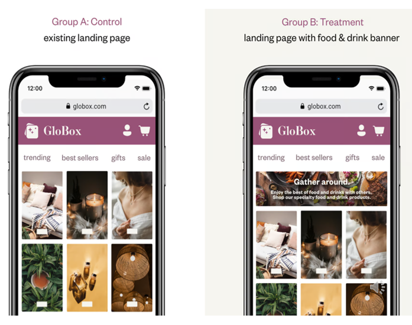
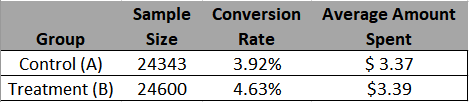
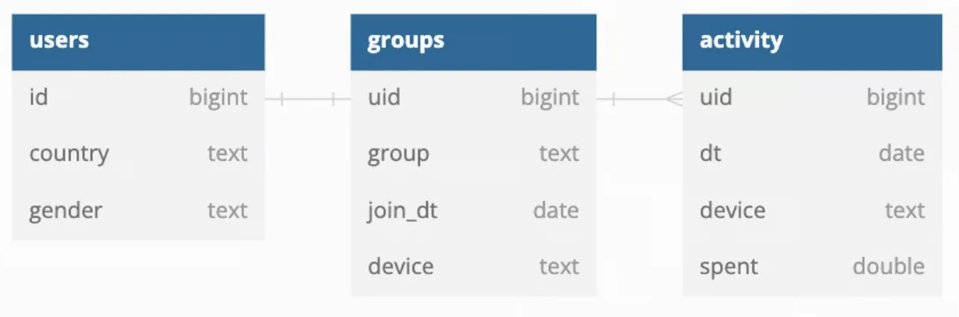
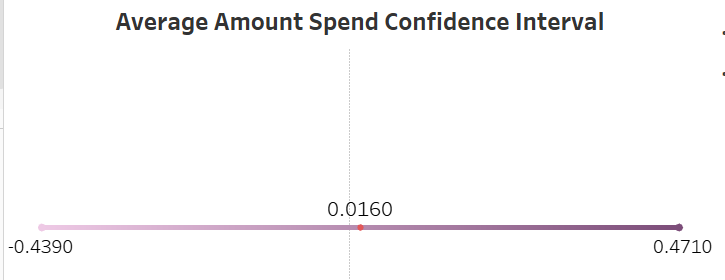
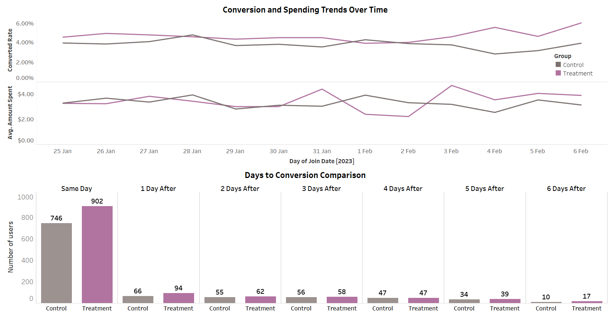

# Globox A/B Test Report: Food and Drink Banner


## Purpose

Globox, an online marketplace renowned for boutique fashion and high-end decor products observed substantial growth in its food and drink offerings. This prompted the company to conduct an A/B test to assess the impact of introducing a food and drink banner on the homepage with the goal of increasing awareness and revenue in this product category. 





## Hypotheses


The null and alternative hypothesis test are stated below.

Null Hypothesis (H₀):
There is no difference in the user conversion rate and average spending between the two groups.

Alternative Hypothesis (H₁):
There is a difference in the user conversion rate and average spending between the two groups.


Statistical notation:

H₀: p₁ = p₂

H₁: p₁ ≠ p₂

Here, p₁ is the proportion for populations in the control group, and p₂ represents the proportion of the population in the treatment group.
​

H0: μ1 = μ2

H1: μ1 != μ2

Here, μ1 is the means for populations in the control group, and μ2 represents the means of the population in the treatment group.


## Methodology

### Test Design

The test aimed to evaluate if the food and drink banner on Globox's mobile website significantly influenced user behavior, leading to increased awareness and revenue. Users were randomly assigned to either a Control group (existing landing page) or a Treatment group (landing page with the added banner). The test metrics used for the analysis were conversion rates and average amount spent per user.
- **Population:** 

    The test groups comprised a total of 48,943 users, with 24,343 randomly assigned to the control group and 24,600 to the treatment group.

  
- **Duration:** 

  The experiment took place over a span of two weeks in 2023, running from January 25th to February 6th.
- **Success Metrics:** 

  The success of the A/B test is evaluated using key metrics (conversion rates and average spend per user) at a significance level of 5% and confidence level of 95%. Conversion rates represents the proportion of users making a purchase, while the average amount spent per user measures purchases made by users in both groups. Below is a table showing the sample size, conversion rate and average amount spent per user for both groups.

    
    


## Results
### Data Analysis

- **Pre-Processing Steps:** 

  
  The analysis involved extracting essential data from a relational database using SQL query to provide insight into user behaviour. 
This process adopts the use of LEFT JOIN syntax to aggregate the three tables shown in the schema below :

    

  - Users Table: contains demographic informations.

  - Groups Table: Records user A/B test group assignments. 

  - Activity Table: Captures user purchase activity. 

 Exploratory data analysis was conducted to derive the conversion rates, number of conversions (spent more than $0), total spent (greater than $0) and average amount spent per users. Null values were removed to include users who did not convert when calculating the amount spent per user.

 
   
 ```sql
-- The conversion rate for the control is 3.92% and treatment group is 4.63%.
WITH converted_table AS (
  SELECT 
        g.uid,
  		CASE WHEN g.group = 'A' THEN 'Control' 
  			ELSE 'Experiment' END AS group,
  		COALESCE(SUM(a.spent),0) As total_spent,
        CASE WHEN SUM(a.spent) > 0 THEN 1
            ELSE 0 END AS converted
        
FROM groups AS g
LEFT JOIN activity AS a
ON g.uid = a.uid
GROUP BY g.uid, g.group
)
SELECT 
    ct.group,
    ROUND(AVG(converted) * 100,2) AS conversion_rate
FROM converted_table AS ct
GROUP BY ct.group;

```
```sql
-- The average amount spent per user including users who did not convert for the Control is $3.37 and Treatment group is $3.39.

WITH converted_table AS (
  SELECT 
        g.uid,
  		CASE WHEN g.group = 'A' THEN 'Control' 
  			ELSE 'Experiment' END AS group,
		COALESCE(SUM(a.spent),0) As total_spent,
        CASE WHEN SUM(a.spent) > 0 then 1
            ELSE 0 END AS converted
   
FROM groups AS g
LEFT JOIN activity AS a
ON g.uid = a.uid
GROUP BY g.uid, g.group
)
				
SELECT 
    ct.group, 
    ROUND(AVG(total_spent),2)  AS avg_spent
FROM converted_table AS ct
GROUP BY ct.group;  
```

```sql
-- Extracted user-level aggregated dataset for test statistic on google colab and visualization of results on Tableau.

SELECT 
    u.id, 
	u.country, 
    u.gender,
    g.device,
    CASE WHEN g.group = 'A' THEN 'Control' 
  		ELSE 'Treatment' END AS group,
    COALESCE(SUM(a.spent),0) AS total_spent,
    CASE WHEN SUM(a.spent) > 0 THEN 1 ELSE 0 END AS converted
FROM users AS u
LEFT JOIN groups AS g
ON u.id = g.uid
LEFT JOIN activity AS a
ON u.id = a.uid
GROUP BY u.id, u.country, u.gender, g.device, g.group
ORDER BY u.id ASC;

```
```sql
-- Novelty Effect Analysis query
WITH Novelty_Data AS (
    SELECT 
  		g.join_dt,
		g.uid,     
        g.group,
        COUNT(DISTINCT g.uid) AS total_users,
        COUNT(DISTINCT a.uid) AS converted_users,
  			CASE WHEN SUM(a.spent) > 0 THEN 1 ELSE 0 END AS converted,
        COALESCE(SUM(a.spent),0) AS total_spent
    
    FROM groups AS g
    LEFT JOIN activity AS a
    ON g.uid = a.uid   
    GROUP BY g.join_dt, g.uid, g.group
)

SELECT 
    nd.join_dt AS join_date,
    nd.group,
    ROUND(AVG(nd.total_spent),2)  AS avg_spent,
    ROUND(AVG(nd.converted) * 100,2) AS converted_rate
    
FROM Novelty_Data AS nd
GROUP BY join_date, nd.group
ORDER BY join_date, nd.group;

```
```sql
-- Days to Conversion Time Analysis
WITH UserConversionData AS (
    SELECT 
        a.uid AS user_id,
        g.group ,
        g.join_dt AS join_date,
        a.dt AS conversion_date,
        SUM(COALESCE(a.spent, 0)) AS total_spent,
        a.dt - g.join_dt AS days_to_conversion
    
  	FROM groups AS g
    JOIN activity AS a 
  	ON g.uid = a.uid
    GROUP BY user_id, g.group, join_date, conversion_date
)

SELECT 
    ucd.group AS user_group,
    COUNT(ucd.user_id) AS total_users,
    ucd.days_to_conversion AS days_to_conversion
FROM 
    UserConversionData AS ucd
GROUP BY 
    ucd.group, ucd.days_to_conversion
ORDER BY 
    days_to_conversion, user_group;

```
```sql
-- User-level aggregated data for 95% confidence interval in Tableau
SELECT u.id, 
  CASE WHEN grp.group = 'A' THEN 'Control' 
  					ELSE 'Treatment' END AS group,
  COALESCE(SUM(act.spent),0) AS total_spent,
  CASE WHEN SUM(act.spent) > 0 THEN 1 ELSE 0 END AS converted
  
FROM users AS u
LEFT JOIN groups AS grp
ON u.id = grp.uid
LEFT JOIN activity AS act
ON u.id = act.uid

GROUP BY u.id, grp.group
ORDER BY u.id ASC;

```
- **Statistical Tests Used:** 

  - The two-sample Z-test with pooled proportion was used for comparing the proportion of the conversion rates between the two groups.

  - The two-sample t-test with unequal variance was used for comparing the means of the amount spent per user between the two gropus.

- **Results Overview:** 

   

  The Z-test conducted to assess whether there is a difference in the the conversion rates between the two groups resulted in p-value of 0.0001 which is less than the significance level (𝛼) of 0.05. The Z-test statistic resulted in -3.3836.

  The t-test conducted to assess whether there is a difference in the the means of the amount spent per user between the two groups resulted in -0.0704 and p-value of 0.944 which is significantly more than the significance level (𝛼) of 0.05.

### Findings

## Interpretation
- **Outcome of the Test(s):** 

    The Z-test result led to the rejection of the null hypothesis, indicating a difference in user conversion rates between the two groups. 
    
    However, the T-test outcome showed that we should not reject the null hypothesis, suggesting no significant difference in average spending per user between the groups.

 

- **Confidence Level:** 

    The  95% confidence interval for the difference in proportions, obtained through a two-sample Z-interval (0.0035 to 0.0107) as shown in the figure below, indicates a statistically significant and positive difference in proportions.

    

    A two-sample t-interval for the difference in means calculated the 95% confidence interval for the difference in the average amount spent per user between the two groups, resulting in a range from -0.439 to 0.471 as shown below.

    


- **Novelty Effect:**

    There is no evidence of novelty effect in the A/B test conducted based on the insights derived from the visualisations below.

  - Visualizations of conversion rates and average spending per user over time didn't reveal consistent patterns indicative of novelty. Fluctuations in these metrics did not show a clear trend suggestive of a short-lived impact. 
  
  - Day-to-conversion comparison visuals indicated high user conversions on the first day for both groups, but subsequent days didn't demonstrate a consistent novelty effect. The lack of significant differences between the Control and Treatment groups in conversion rates and average spending suggests that observed fluctuations were unlikely due to novelty.

    


## Conclusions
- **Key Takeaways:** 

  The key takeaway from this A/B test is that there is a statistically significant difference in conversion rates between the Treatment and Control groups. The Z-test results indicates a strong evidence that the changes introduced in the Treatment group positively impacted conversion rates, with the Treatment group likely exhibiting a higher conversion rate compared to the Control group.

  However, it is important to note that the t-test results, while indicating a statistically significant difference, also suggest caution regarding the practical significance of the observed differences.
Additionally, the visualizations and analysis do not indicate evidence of a novelty effect, and the fluctuations in conversion rates and average spending over time do not show consistent patterns indicative of short-lived impacts.

- **Limitations/Considerations:** 

    Although the A/B test sample size was adequate for identifying statistically significant differences, expanding the sample size could yield more accurate estimates and diminish the margin of error. It is advisable to conduct forthcoming tests with larger sample sizes to support the reliability of the outcomes.

    It is worth noting that test outcomes might diverge among user segments, particularly when comparing new and returning users. Exploring further analysis to pinpoint variations in the impact of alterations across distinct user segments could provide valuable insights.

    Additionally, the duration of the A/B test could influence the results, particularly if user behavior undergoes changes over time. It is prudent to factor in the business context and potential seasonal effects when determining the test duration.


## Recommendations
- **Next Steps:** 

  I recommend Globox management consider launching the food and drink banner, as it appears to have positively impacted the conversion rate. The Treatment group saw a conversion rate of 4.63% compared to the Control group's 3.92%, indicating a positive influence. Additionally, the low cost of implementing the banner adds to its appeal.

  Given that users exposed to the banner demonstrate a higher likelihood of making purchases compared to those who didn't see it, launching the food and drink banner on the company website stands to capitalize on these noteworthy conversions.
- **Further Analysis:** 

    - Carry out a more detailed analysis to monitor the user engagemant and their spending behaviour within the food and drink category.

  
